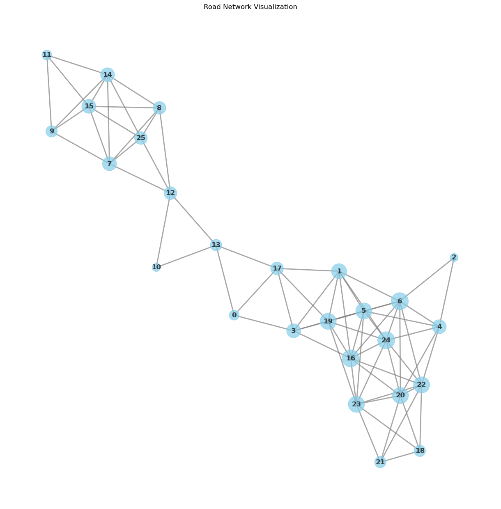
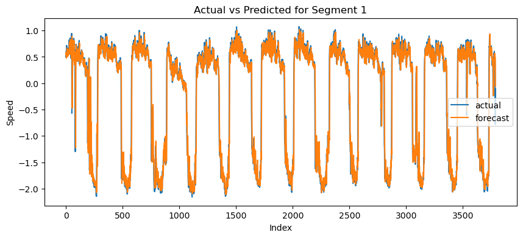
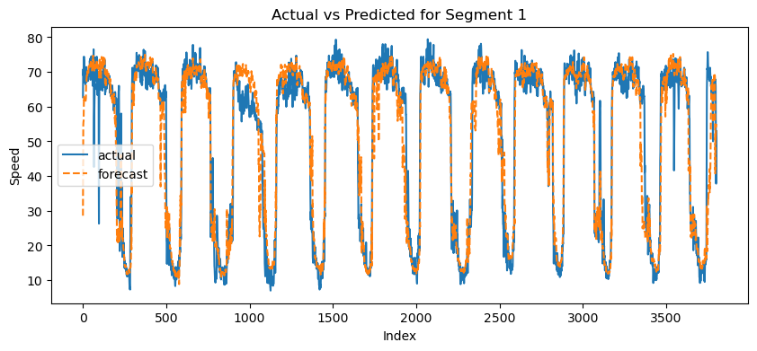
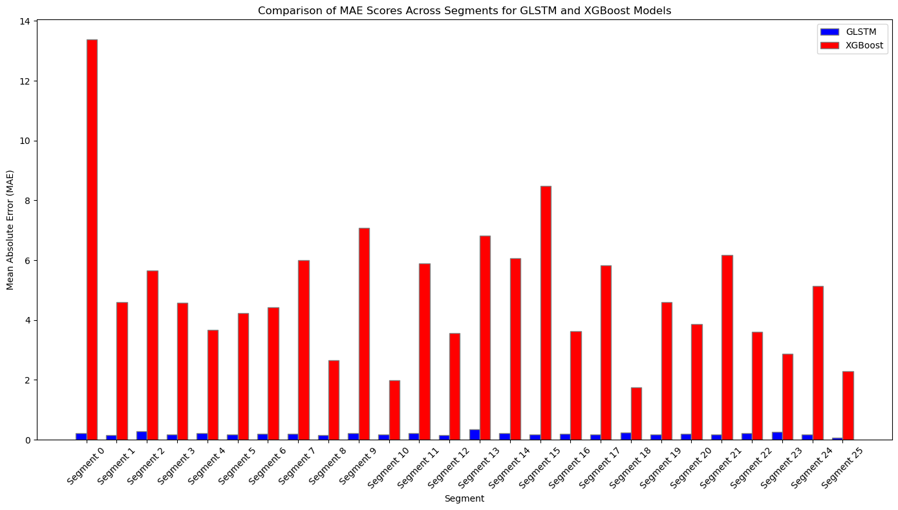

# Traffic Speed Forecasting using GNN and LSTM

This repository explores innovative methods for predicting road segment speeds using historical time-series data, with a focus on integrating both traditional machine learning techniques and advanced neural network models.

## Project Description

The purpose of this project is to evaluate two different approaches for traffic speed forecasting:

1. **Traditional Approach**: Utilizes XGBOOST, a well-known machine learning algorithm, to predict the speed of individual road segments based on historical data.

2. **Novel Approach**: Inspired by the work of Arash Khodadadi and further based on research by Bing et al., this method leverages a Graph Neural Network (GNN) combined with Long Short-Term Memory (LSTM) networks. This approach considers the relationships between multiple road segments to enhance prediction accuracy.

Further reading and foundational research can be found in these resources:
- [STGCN on Spatio-Temporal Data](https://github.com/VeritasYin/STGCN_IJCAI-18)
- [Keras Time Series Forecasting](https://keras.io/examples/timeseries/timeseries_traffic_forecasting/)

## Data Description

The dataset used in this project is derived from the PeMSD7 dataset, which was processed and cleaned by Yu et al. This dataset provides detailed traffic speed recordings and is specifically designed to support advanced traffic analysis and forecasting models.

**Data Files**:
- `PeMSD7_W_228.csv`: Contains the distances between 228 monitoring stations in California's District 7.
- `PeMSD7_V_228.csv`: Comprises traffic speed data collected from these stations during weekdays in May and June of 2012.

More about the dataset and the preprocessing methods can be found in these publications:
- [STGCN GitHub Repository](https://github.com/VeritasYin/STGCN_IJCAI-18)
- [Spatio-temporal Graph Convolutional Networks by Yu et al.](https://arxiv.org/abs/1709.04875)

## Methodology

### XGBoost Model
- **Feature Engineering**: Includes time of day, day of the week, and derived features like rolling means and lagged features.
- **Model Training**: Employs cross-validation to prevent overfitting and ensure generalization.

### GNN/LSTM Model
- **Graph Construction**: Represents the traffic network as a graph where nodes are road segments.
- **Model Training**: Combines graph convolution layers with LSTM to handle both spatial and temporal data.

## Figures

The following visualizations demonstrate the various aspects of the models and their performance for selected 26 segments out of 228:

- **Figure 1**: Graph adjacency between the 26 road segments (shown as nodes). This visual helps illustrate the interconnections within the traffic network as modeled in the GNN.
  

- **Figure 2**: Actual and fitted testing speed data using the GNN/LSTM model for segment 1. This figure highlights the model’s accuracy in capturing the complex patterns of traffic speeds.
  

- **Figure 3**: Actual and fitted testing speed data using the XGBOOST model for segment 1. It compares the predictive capabilities of a traditional machine learning approach against the traffic data.
  

- **Figure 4**: MAE comparison between the GNN/LSTM (blue) and XGBOOST (red) models for all segments. This chart provides a quantitative analysis of the models' performance across the network.
  

These results collectively underscore the efficacy of the GNN/LSTM model in traffic speed forecasting, highlighting its potential to provide more accurate and reliable predictions by leveraging both spatial relationships and temporal data.

## Citation

If you find this project useful or use the dataset in your own research, please consider citing the following works:

- Keras Time Series Traffic Forecasting Example: [Visit here](https://keras.io/examples/timeseries/timeseries_traffic_forecasting/)
- STGCN on Spatio-Temporal Data GitHub Repository: [Visit here](https://github.com/VeritasYin/STGCN_IJCAI-18)
- Spatio-temporal Graph Convolutional Networks: A Deep Learning Framework for Traffic Forecasting (arXiv): [Read the paper](https://arxiv.org/pdf/1709.04875.pdf)

